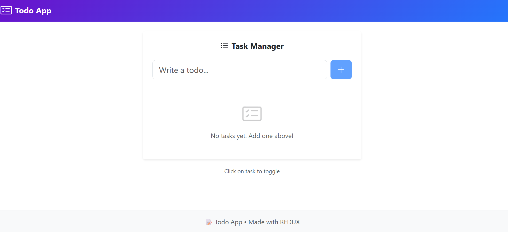
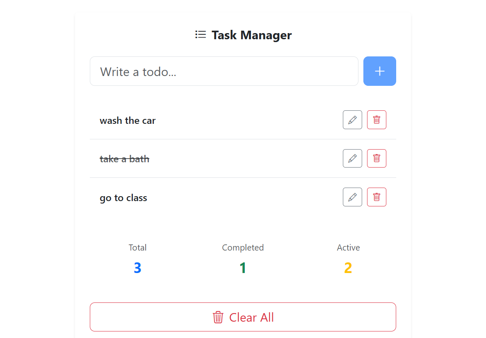

Todo App with Redux & TypeScript 📝✨

A simple Todo application built with React, Vite, TypeScript, Redux, and Bootstrap for styling and layout.
Designed to demonstrate the use of Redux with TypeScript in a scalable and type-safe way. ✅

Features 🚀

➕ Add new todos

✔️ Mark todos as completed

❌ Delete todos

🗂️ State management with Redux + TypeScript

🛡️ Fully typed actions, reducers, and state

⚡ Fast and responsive UI with Vite

Screenshots 📸

Technologies Used 💻

⚛️ React – Front-end library for building UI components

🟦 TypeScript – Adds type safety to JavaScript

🛠️ Redux – Predictable state management

🧩 Redux Toolkit – Simplifies Redux setup

🎨 CSS / SCSS – Styling

Installation 🛠️

Clone the repository:

git clone <your-repo-url>

Install dependencies:

npm install

Start the development server:

npm start

The app will run at http://localhost:5173
.

Redux & TypeScript Implementation 🔧

State & Types: All todos and actions are fully typed for safety. 🛡️

Actions & Reducers: Defined with TypeScript interfaces and createSlice from Redux Toolkit. ⚡

Store: Centralized state using Redux, connected to React with Provider. 🗄️

This setup ensures type safety, predictable state changes, and scalability. ✅